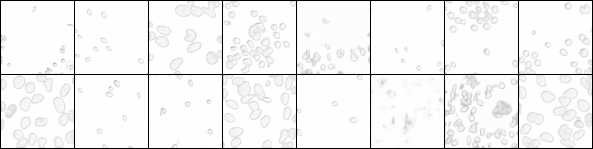

# Text Localization
A setup to solve text localization or more general object detection problems without finding bounding boxes as many prevalent methods do.
## DSB2018
It's basically an object detection task about finding the mask of each nuclei in given images. Detailed discription can be found here: [DSB2018](https://www.kaggle.com/c/data-science-bowl-2018)
To illustrate the effectness of the proposed method, I use this dataset as a starting point.
### Supervision label

These are example raw input images after being rescaled to a given size. ((128,128) in this case)
The output of the network would be a number of ```w * h``` feature maps, where ```w``` and ```h``` are the same as the input images (128, 128). Each feature map is a probability map that corresponds to a certain property of the input image.
#### Classes output
The first ```c``` maps are related to the classes (2 in this case, background and nuclei, or similarly background and text). For example, in the background feature map, all pixels belong to background should be trained towards 1 and other pixels that belong to nucleis should be set to 0 instead.
##### Background:
ground truth:

network output:

##### Nuclei:
ground truth:

network output:


#### Offsets output
The rest  ```f``` maps are related to the offsets. For instance, If given a offset of (0, 1), the value of pixel (x, y) will be decided by its relationship with pixel (x+0, y+1). If they are of the same object, then this value should be 1, and otherwise, it should be 0.
#### offset (1, 1)
ground truth:

output

#### offset (0, -2)
ground truth

output


### Network
I use [Unet](https://arxiv.org/pdf/1505.04597.pdf) as network architecture, and [BCE Loss](http://pytorch.org/docs/0.3.1/nn.html#torch.nn.BCELoss) as loss function. (Soft dice loss might be more popular in this scenario but it seems BCE Loss has better performance in my experiment by now). You could refer to ```run.sh``` for other settings. 